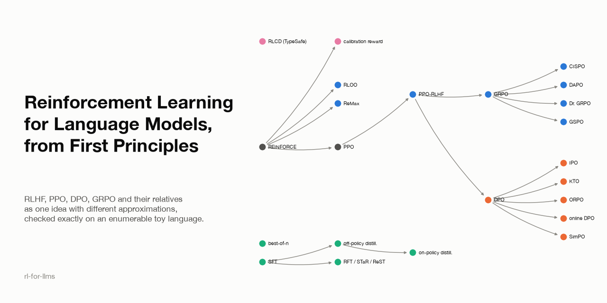

# rl-for-llms

**Reinforcement Learning for Language Models, from First Principles**: why RLHF, PPO, DPO,
GRPO and their relatives are one idea with different approximations.

- Site (once deployed): **[ioannisantoniadis.github.io/rl-for-llms](https://ioannisantoniadis.github.io/rl-for-llms/)**
- Status: all twelve chapters, the map, the unified table and the appendices are written; see
  [`ROADMAP.md`](ROADMAP.md) for the decision log.



## What this is

A small Quarto book plus a small, readable codebase of toy experiments. It explains
reinforcement learning as it is used to post-train large language models, starting from first
principles, for an engineer who learned RL as a separate subject (MDPs, Bellman equations,
Q-learning) and then watched post-training adopt a stream of new names.

The argument, in three sentences. RL differs from supervised learning in *where the data comes
from* and *what the feedback says*, not in the model or the loss. The policy gradient is weighted
maximum likelihood on samples the learner chose to generate, so almost every post-training
method is a choice of *sampling distribution* and *per-sample weight*. And nearly all of them
target one distribution: the reference policy tilted by $\exp(r/\beta)$.

Every method gets a **method card** with the same eight fields (signal, what it samples from, how
it weights samples, what keeps it stable, credit granularity, models in memory, what it targets,
and which classical RL idea it inherits), so a new method can be placed on the map in minutes.

## The testbed

Most experiments run on one **enumerable toy language**: 5 tokens, responses of length 4 (625
possible responses), a few prompts, a reference policy pretrained by maximum likelihood, and a
verifiable reward. Because the response space can be enumerated, the exact optimum $\pi^\star$,
every KL divergence and the true policy gradient are computed exactly, and every algorithm is
measured against ground truth.

## Contents

**The map**: the feedback space, the method lineage, and the six axes hidden behind method names.
**I. RL from first principles**: what makes a problem RL; policy gradients; keeping updates
stable (trust regions, KL).
**II. Language generation as an RL problem**: the LLM as a policy; where rewards come from and
how they break.
**III. The methods, derived**: the shared target and RLHF with PPO; direct preference methods;
policy gradients without a critic (GRPO and its 2025 fixes); imitating a better distribution
(filtering and distillation); rewarding calibration (RLCD and proper scoring rules).
**IV. Synthesis**: what RL actually does to a model; a decision guide and the unified table.

## Repository layout

```
docs/                Quarto book (site source); figures are pre-generated PNGs in docs/images/
src/rl4llm/          the testbed and from-scratch methods (numpy + scipy)
  toy_language.py      vocabulary, prompts, reference policy, rewards, exact pi*
  metrics.py           exact KL, expected reward, entropy, pass@k
  estimators.py        baselines/advantages, KL estimators k1/k2/k3, PPO clip
  methods/             exact, reinforce, ppo, grpo, dpo (+ IPO, SimPO, online), rft
                       (+ weighted, iterated filtering), distill (on- and off-policy)
  reward_model.py      learned Bradley-Terry proxy reward; exact best-of-n
  kl_penalties.py      exact gradients of every KL-penalty implementation
  calibration.py       answer-plus-confidence task for proper-scoring-rule rewards
  loglinear.py         a shared-feature policy (likelihood displacement)
tests/               numerical checks of the book's derivations against exact enumeration
scripts/figures/     one script per figure, each a real computation
scripts/method_data.py   one record per method: generates the unified table, lineage, map, timeline
CONVENTIONS.md       authoring conventions (chapter template, method cards, figures)
ROADMAP.md           chapter plan, figure and experiment lists, decision log
research-log.md      every source consulted and what was verified
```

## Build

```bash
uv sync --extra figures --extra dev
uv run pytest                                            # derivation checks
uv run python scripts/figures/fig_all_roads_to_pi_star.py # regenerate a figure
uv run python scripts/build_unified_table.py              # regenerate the unified table
quarto render docs                                       # build the site (Quarto CLI required)
```

## License

MIT; see [LICENSE](LICENSE).

---

Companion books by the same author:
[loss-functions-lab](https://github.com/ioannisantoniadis/loss-functions-lab) (where the
Bradley–Terry, DPO and proper-scoring-rule derivations live),
[modern-ai-systems-and-methods](https://github.com/ioannisantoniadis/modern-ai-systems-and-methods)
(the short overview this book expands),
[optimization-lab](https://github.com/ioannisantoniadis/optimization-lab) and
[transformer-atlas](https://github.com/ioannisantoniadis/transformer-atlas) (architectures; this
repo is the training-methods map it leaves out).
